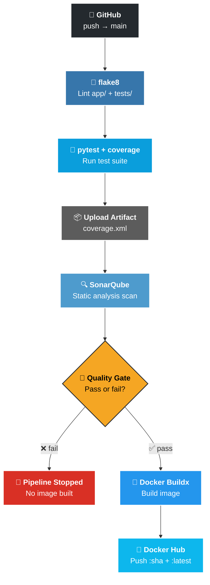
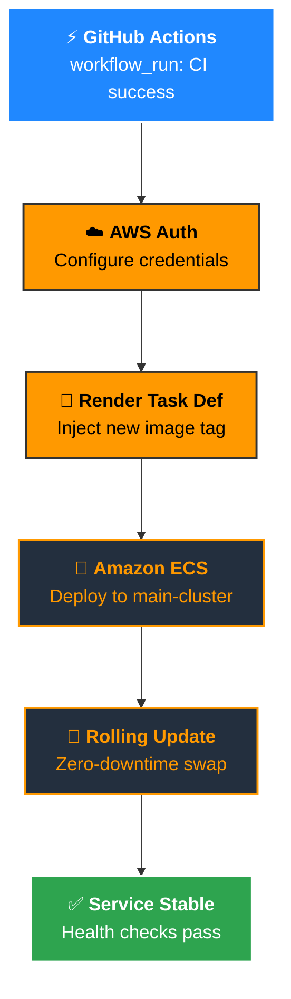

<div align="center">

# 🔗 URL Shortener — CI/CD to ECS

**A minimal FastAPI URL shortener built to showcase a production-grade CI/CD pipeline —**
**lint → test → SonarQube → Docker Hub → AWS ECS.**

*The shortener is the excuse. The pipeline is the point.*


</div>

---

## 🚀 What this is

A single-table URL shortener API — custom aliases, expiry, QR codes, bulk shorten, click tracking.
No auth, no rate limiting, no analytics tables — deliberately minimal, so the pipeline stays the focus, not the app.

Every push to `main` triggers a full pipeline: **lint → test + coverage → SonarQube quality gate → Docker build & push → ECS rolling deploy.**

---

## 🧩 Pipeline Architecture

### 1️⃣ CI Pipeline — `ci.yml`



### 2️⃣ CD Pipeline — `cd.yml` *(triggers automatically when CI succeeds)*



### 🔑 Icon Legend

| Icon | Tool | Role in the pipeline |
|:---:|---|---|
| 🐙 | **GitHub** | Trigger — push to `main` |
| 🐍 | **flake8** | Lint `app/` + `tests/` |
| 🧪 | **pytest / coverage** | Unit tests + coverage report |
| 📦 | **Actions Artifact** | Carries coverage.xml into the Sonar job |
| 🔍 | **SonarQube** | Static analysis + quality gate |
| 🐳 | **Docker Buildx** | Build the image |
| 🔐 | **Docker Hub** | Image registry (SHA-tagged + `latest`) |
| ⚡ | **GitHub Actions** | `workflow_run` links CI → CD |
| ☁️ | **AWS IAM** | Auth for ECS deploy |
| 🚀 | **Amazon ECS** | Task definition render + rolling deploy |

| **Deploy** | AWS ECS | Renders new task definition, rolling deploy, waits for service stability |

---

## ⚙️ Tech Stack

| Layer | Choice |
|---|---|
| API | FastAPI + Pydantic v2 |
| ORM | SQLAlchemy 2.0 |
| DB | MySQL 8 (containerized) |
| QR Codes | `qrcode[pil]` |
| Local dev | Docker Compose |
| CI | GitHub Actions |
| Code quality | flake8 + SonarQube |
| Registry | Docker Hub |
| Deployment | AWS ECS (Fargate/EC2 via task definition) |

---

## 📡 API Endpoints

| Method | Endpoint | Description |
|---|---|---|
| `POST` | `/shorten` | Shorten a single URL (optional custom alias + expiry) |
| `POST` | `/shorten/bulk` | Shorten multiple URLs in one call |
| `GET` | `/{short_code}` | Redirect to original URL (302 / 404 / 410 if expired) |
| `GET` | `/stats/{short_code}` | Click count + metadata for a short code |
| `GET` | `/qr/{short_code}` | PNG QR code for the short URL |
| `GET` | `/health` | Health check (verifies DB connectivity) |

---

## 🏃 Run it locally

```bash
git clone https://github.com/ArshadKhan-007/URL-SHORTENER-CI-CD-ECS.git
cd URL-SHORTENER-CI-CD-ECS
cp .env.example .env      # fill in DB credentials
docker compose up --build
```

App is live at `http://localhost:8000` — interactive docs at `http://localhost:8000/docs`.

```bash
# Example: shorten a URL
curl -X POST http://localhost:8000/shorten \
  -H "Content-Type: application/json" \
  -d '{"url": "https://example.com/some/very/long/path"}'
```

---

## 🔐 CI/CD Secrets Required

| Secret | Used by |
|---|---|
| `SONAR_TOKEN`, `SONAR_HOST_URL` | SonarQube scan + quality gate |
| `DOCKERHUB_USERNAME`, `DOCKERHUB_TOKEN` | Docker image push |
| `AWS_ACCESS_KEY`, `AWS_SECRET_KEY` | ECS deploy |

---

## 🛡️ AWS IAM — Least Privilege for ECS Deploy

For the CD pipeline, create a dedicated AWS IAM user instead of using root or admin credentials. Grant it access to ECS only — following the least privilege principle keeps the security risk minimal even if the key ever leaks.

Generate that user's security credentials (Access Key ID + Secret Access Key) and add them to the GitHub repo as `AWS_ACCESS_KEY` and `AWS_SECRET_KEY` secrets — `cd.yml` already picks these up for the ECS deploy step.

---

## 📁 Project Structure

```
.
├── app/                  # FastAPI application
│   ├── main.py           # Routes (6 endpoints)
│   ├── models.py         # SQLAlchemy ORM
│   ├── schemas.py        # Pydantic request/response models
│   ├── crud.py
│   ├── database.py
│   └── config.py
├── tests/                # pytest suite
├── db/init.sh            # MySQL init script
├── .github/workflows/
│   ├── ci.yml             # lint → test → sonar → docker push
│   └── cd.yml             # ECS rolling deploy on CI success
├── task-definition.json   # ECS task definition
├── docker-compose.yml     # local dev stack
└── Dockerfile
```
